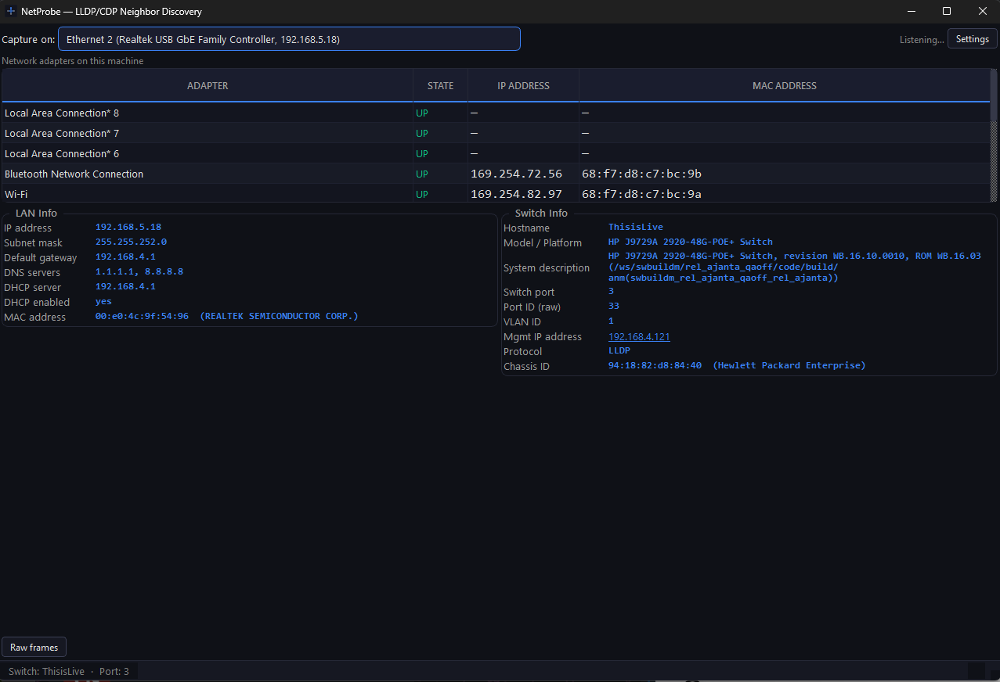

# LinkSight

Passive LLDP/CDP neighbor discovery for Windows, macOS, and Linux — identify which switch port and VLAN your device is connected to.



Plug into an Ethernet port and LinkSight presents the network environment in three panels:

- **NIC Status** — lists network adapters on the local machine with link status, IP address, MAC address, and hardware descriptions.
- **LAN Info** — attached network identity: IP, subnet mask, gateway, DNS servers, DHCP server, and lease details read from the operating system and passively observed DHCP traffic.
- **Switch Info** — neighbor device connected to the active switch port: system hostname, hardware model, switch port ID and port description, VLAN ID, and management IPs. **Management IPs are clickable**: clicking an IP prompts for an SSH username, then launches a system terminal session with `ssh username@ip`. Passwords are typed directly into the terminal's ssh prompt; LinkSight never captures or stores credentials.

No historical logs, no active scanning, and no background tracking — LinkSight operates as an in-memory readout. Packet capture starts automatically upon launch on the preferred adapter, and selecting a different interface from the dropdown updates the capture stream live.

## Upstream Discovery

Starting from the switch LinkSight discovers passively, **Upstream Discovery** traces the physical switch chain upstream to the network edge (core switch / STP root / default gateway router or firewall).

- **Path-focused hop cards & diagnostics:** Hop cards show traced path ports by default (downlink to previous hop / endpoint and uplink to next hop) with full per-port diagnostic sweeps available behind an expander (PVID, allowed VLANs, STP state, link speed, and neighbor identity).
- **Firewall Edge & WAN Handoff:** Tracing extends through the firewall edge: querying the firewall's IF-MIB interface table and default route (0.0.0.0/0) identifies the active WAN interface, negotiated speed, operational status, and upstream ISP gateway IP. If a firewall responds to system identity queries but restricts interface or routing table walks, discovery degrades gracefully to render the edge device hop without failing the walk.
- **STP Root Direction Rule:** Discovery walks strictly along each switch's spanning tree root port (`dot1dStpRootPort`), preventing recursion into downstream IDF switches. The walk terminates cleanly when reaching the STP root bridge or an edge router/firewall. On switches whose SNMP agent does not expose the spanning-tree MIBs (e.g. UniFi), discovery falls back to LLDP neighbor direction; a switch with no visible upstream neighbor is treated as the network edge.
- **Privacy & In-Memory Credentials:** The SNMP read community is prompted once when starting discovery, stored only in RAM for the process lifetime, and is never written to disk, configuration files, or sent to external servers.
- **Prerequisites & Fallback:** Requires SNMP v2c read access on the managed switches. When a switch does not advertise a management IP via LLDP/CDP (common on UniFi and some other vendors), LinkSight auto-resolves the switch's management IP from its chassis MAC via an ARP sweep of the local subnet; if that also fails, the walk can start from a manually entered switch IP. If an intermediate switch does not have SNMP enabled or does not respond, discovery stops gracefully at that hop and presents the last reachable segment.

## Design

Dark, engineering-focused UI designed for readability, high information density, and instant status assessment.

## Quick Start

```bash
python -m venv .venv
source .venv/bin/activate        # Windows: .venv\Scripts\activate
pip install -r requirements.txt
python app.py                    # capture starts automatically
python app.py --demo             # replay simulated network frames without capture privileges
```

## Build

- **Windows (Folder / Portable):** `python build_exe.py` → `dist/LinkSight/LinkSight.exe` (portable directory, extracts once at build time for instant startup; Npcap required on target).
- **Windows (Single File):** `python build_portable.py` → `dist/LinkSight-Portable.exe` — single self-contained executable without `_internal/` folder. Convenient for remote deployment tools that transfer a single binary, though startup takes several seconds while decompressing to a temporary directory on each run.
- **macOS:** `python build_mac.py` → `dist/LinkSight.app` and `dist/LinkSight-mac.zip` (portable application bundle).

### Release via GitHub Actions

Tag a release to trigger automated multi-platform builds and a GitHub Release:

```bash
git tag linksight-v1.0.0
git push origin linksight-v1.0.0
```

The workflow (`.github/workflows/linksight.yml`) runs the test suite, builds Windows (portable folder and single-file executable) and macOS bundles, and publishes the release with downloadable artifacts attached.

## Requirements & Privileges

- **Windows:** Npcap driver installed (available from [npcap.com](https://npcap.com/#download)). Administrator privileges are typically required for raw packet capture.
- **macOS:** Packet capture requires BPF device access permissions (admin privileges / terminal permission).
- **Linux:** Requires `CAP_NET_RAW` capability (e.g. running via `sudo` or Docker `cap_add: [NET_RAW]`).

## Debugging

The **Raw frames** toggle at the bottom expands a live hexdump feed of captured LLDP, CDP, and DHCP frames, allowing frame verification against packet analyzers like Wireshark.

## Project Structure

```
app.py                  Application entry point
build_exe.py            Windows portable build script (PyInstaller onedir)
build_portable.py       Windows single-file portable build script
build_mac.py            macOS portable build script (.app + zip)
linksight.spec          PyInstaller spec (Windows onedir)
linksight-onefile.spec  PyInstaller spec (Windows single-file with slimmed Qt dependencies)
linksight-mac.spec      PyInstaller spec (macOS bundle)
linksight/
  capture/              Packet sniffing (Scapy), interface enumeration, Npcap helper, demo replay
  discovery/            SNMP upstream walker, classifier, pure-Python client, models, demo fixtures
  parse/                LLDP, CDP, and DHCP frame parsers and data models
  ui/                   PySide6 readout widgets, styling, and controller
tests/                  pytest suite and byte-accurate frame fixtures
```
